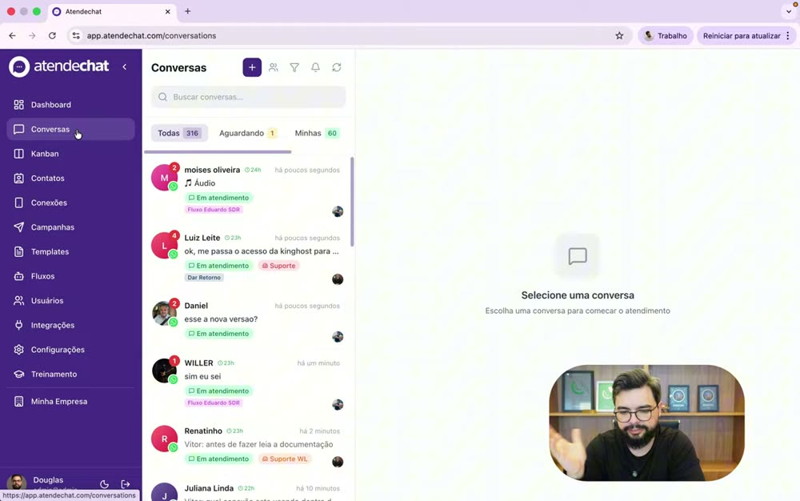
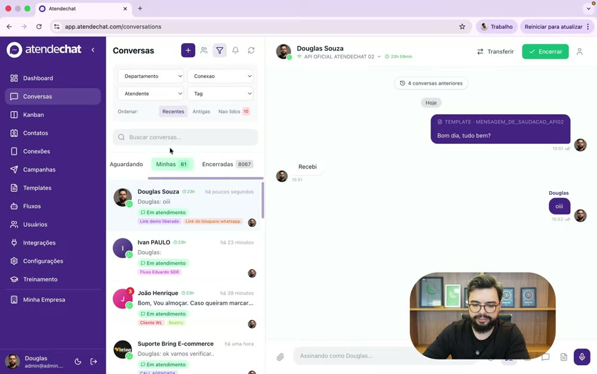
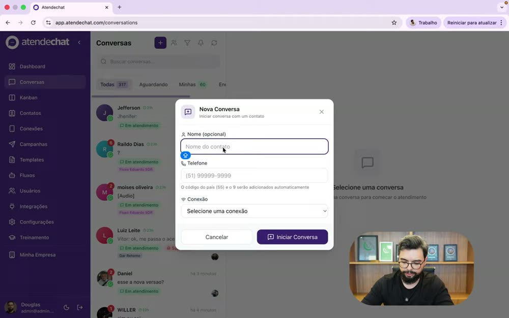
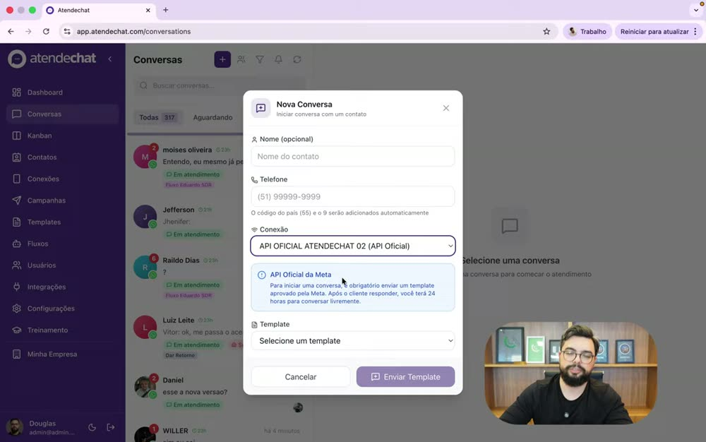
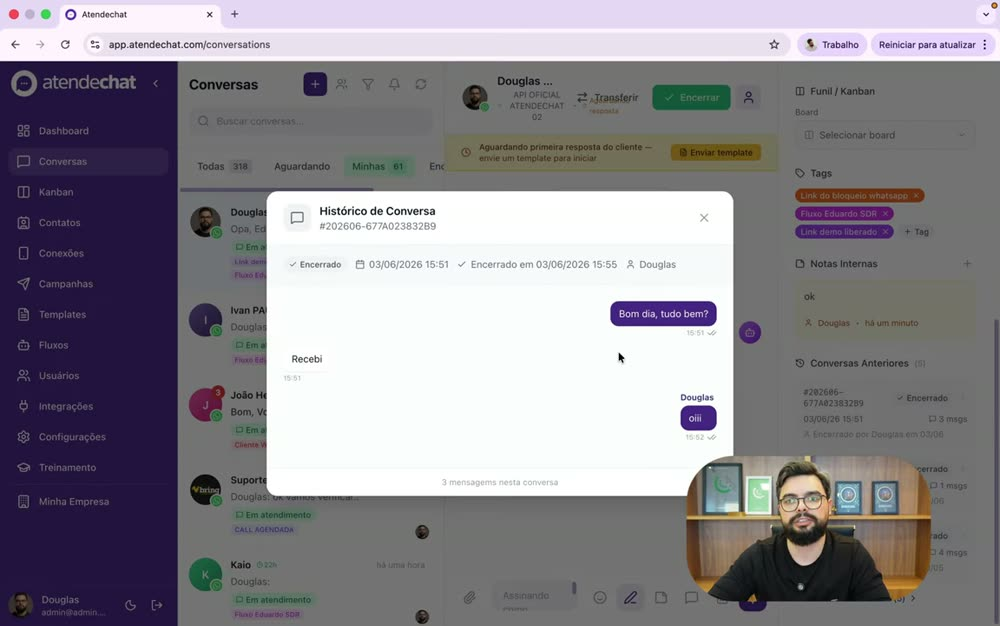
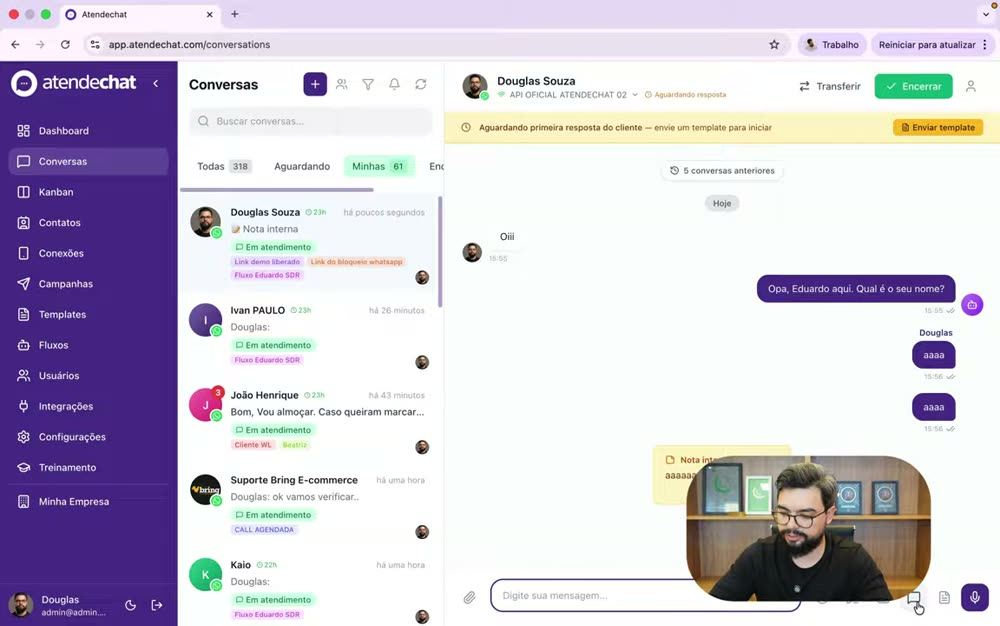
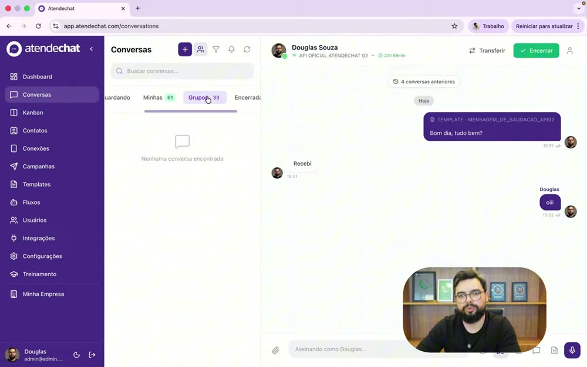

# Atendechat × DeskcommCRM — a tela de atendimento, lado a lado

> **O que é isto.** Análise do vídeo [“Conversas / multiatendimento” do Atendechat](https://www.youtube.com/watch?v=5uPGgQhSZ3Y)
> (7min40, em português), comparada **item por item** com o que o DeskcommCRM tem hoje no código.
> Feito em 2026-09-11, contra a branch `vps/pljr-combinada`.
>
> **Como ler.** A seção 2 é a lista do que **temos**, a 3 é do que **não temos**, a 4 é o que temos **e eles não**,
> e a 5 diz o que vale virar PR para o repositório do Rafael — em ordem de esforço.
>
> **Regra que este documento seguiu:** nenhuma afirmação sobre o nosso lado é chute. Cada linha da coluna
> “onde está” aponta arquivo real, medido com `grep`/leitura. Onde não achei, escrevi **não existe** — não
> “provavelmente não existe”.

> ⚠️ **As imagens são frames de um vídeo público do concorrente, capturados para análise interna.**
> Elas ficam aqui para nós entendermos a tela. **Não devem ir no corpo de um PR para o repositório
> público** — o PR leva a especificação da funcionalidade, escrita com nossas palavras, e no máximo
> um screenshot da **nossa** tela. Mandar print de produto alheio num repo open-source é risco jurídico
> desnecessário, e a informação útil (o comportamento) não precisa da imagem para ser transmitida.

---

## 1. O que o vídeo mostra

O Atendechat chama a tela de conversas de “funcionalidade mãe”. É a caixa de entrada de WhatsApp
multi-atendente: a fila chega, o robô responde, um humano assume, transfere, encerra, e o histórico fica salvo.

O menu lateral deles tem 13 itens: Dashboard, Conversas, Kanban, Contatos, Conexões, Campanhas, Templates,
Fluxos, Usuários, Integrações, Configurações, Treinamento, Minha Empresa.

**Os quatro números do topo (`Todas 316 · Aguardando 1 · Minhas 60 · Encerradas 8067`)** são a espinha
dorsal da tela: *Todas* mostra a equipe inteira conversando (só admin/supervisor vê), *Aguardando* é quem
acabou de chegar e ainda está com o robô, *Minhas* é o que o atendente logado assumiu, *Encerradas* é o arquivo.
A regra de ouro deles: **enquanto está em Aguardando, o robô responde; no instante em que um humano clica
para atender, o robô cala.**

---

## 2. O que NÓS TEMOS (paridade ou melhor)

| # | Funcionalidade no vídeo | Como está no DeskcommCRM | Onde está no código |
|---|---|---|---|
| 1 | Abas com contador (Todas / Aguardando / Minhas / Encerradas) | **Temos, com uma aba a mais.** Nossas abas são `Fila`, `Minhas`, `Todas`, `Fechadas` e **`Automático`** — a quinta separa o que a IA está atendendo agora, coisa que eles não têm | `components/inbox/InboxFilters.tsx:23-34`; contadores em `app/api/v1/conversations/counts/route.ts` |
| 2 | Admin/supervisor vê a equipe inteira; atendente vê o dele | **Temos**, e por RLS de verdade (`organization_id` + papel), não por filtro de tela | `app/api/v1/conversations/_handler.ts`; política `tenant_isolation_conversations_all` |
| 3 | Robô responde em Aguardando; humano assume e o robô cala | **Temos, e mais fino.** Além do “assumir” (que cala o automático), temos **Liberar**, **Pausar o automático** e **Devolver ao automático** como ações separadas | `components/inbox/ConversationHeader.tsx:212-279`; rotas `claim`, `release`, `pause-ai`, `reactivate-bot` |
| 4 | Busca de conversa por nome / telefone | **Temos, e busca também dentro da mensagem** (“Buscar por nome, telefone ou mensagem…”) | `components/inbox/InboxFilters.tsx:120` |
| 5 | Filtro por conexão (número de WhatsApp) | **Temos** | `InboxFilters.tsx:148-171` |
| 6 | Filtro por tag | **Temos** | `InboxFilters.tsx:178-195` |
| 7 | Filtro “não lidas” | **Temos** | `InboxFilters.tsx:140` |
| 8 | Transferir conversa para outro atendente | **Temos, com motivo opcional registrado** | `components/inbox/ReassignDialog.tsx`; `POST /api/v1/conversations/[id]/transfer`; tabela `conversation_assignment_events` |
| 9 | Relógio da janela de 24h da API oficial | **Temos, e melhor.** O selo mostra o tempo restante e, quando fecha, a tela **explica e oferece o envio do modelo aprovado ali mesmo** — o Atendechat mostra só o contador | `components/inbox/JanelaSelo.tsx`, `components/inbox/JanelaFechadaAviso.tsx` |
| 10 | Aviso “aguardando primeira resposta — envie um template” + botão | **Temos** (o mesmo `JanelaFechadaAviso`, com seletor de modelo aprovado) | `JanelaFechadaAviso.tsx:118-168` |
| 11 | Encerrar conversa | **Temos, e exigimos o desfecho**: Resolvida / Convertida / Não procede / Encerrada pelo cliente / Perdida / Expirada sem resposta | `components/inbox/CRMSidePanel.tsx:121-129`; `POST /api/v1/conversations/[id]/close` |
| 12 | Painel lateral com ficha do contato | **Temos**, com contato, tags, lead, demandas abertas, memória do contato, leads recentes, pedidos recentes e atividade | `components/inbox/CRMSidePanel.tsx` |
| 13 | Vincular a conversa a um funil / Kanban | **Temos** (botão “Lead”, funil e etapa, campos extras do funil) | `CRMSidePanel.tsx:370-593`; tabelas `crm_leads`, `crm_pipelines`, `crm_stages` |
| 14 | Tags na conversa e no contato | **Temos as duas**, separadas | `ConversationTagsEditor.tsx`, `ContactTagsEditor.tsx` |
| 15 | Notas internas | **Temos** | `components/inbox/NoteCard.tsx`; tabela `conversation_notes`; rotas `/notes` |
| 16 | Anexar arquivo (PDF, documento, imagem) | **Temos** | `components/inbox/composer/AttachMenu.tsx`, `AttachmentPreviewDialog.tsx` |
| 17 | Emoji | **Temos** | `components/inbox/composer/EmojiButton.tsx` |
| 18 | Gravar e enviar áudio | **Temos** | `components/inbox/composer/AudioRecorder.tsx` |
| 19 | Respostas rápidas / atalhos de frase pronta | **Temos, por `/` no campo de texto** (slash-menu, filtra por título e atalho) | `components/inbox/composer/TemplateMenu.tsx`; tela em `/app/templates` (“Respostas rápidas”) |
| 20 | Menu de templates da API oficial | **Temos** (dentro do aviso de janela fechada) | `JanelaFechadaAviso.tsx:143-158`; tabela `meta_templates` |
| 21 | Som de notificação de chat | **Temos**, com preferência por usuário e push | `lib/notifications/sounds.ts`, `emit.ts`; tela `/app/settings/notifications` |
| 22 | Recarregar a lista | **Não precisamos de botão — é realtime** (Supabase Realtime, a lista se atualiza sozinha) | `hooks/inbox/useConversationsRealtime.ts` |
| 23 | Histórico das conversas encerradas do mesmo contato | **Temos parcialmente.** Existe “Histórico encerrado” no painel, mas mostra só o **desfecho**, não as mensagens. Ver item ③ da seção 3 | `CRMSidePanel.tsx:424,696` |
| 24 | Kanban, Contatos, Conexões, Templates, Usuários, Integrações, Configurações | **Temos todos** | `/app/kanban`, `/app/contacts`, `/app/connections`, `/app/templates`, `/app/team`, `/app/webhooks`, `/app/settings` |

---

## 3. O que NÃO TEMOS

Seis lacunas reais. As três primeiras são as que um cliente que vem do Atendechat vai sentir falta na primeira hora.

### ① Departamentos / setores de atendimento — **não existe**

**No vídeo (04:01 e 05:12):** o filtro tem “Departamento”, a transferência tem a aba **Departamento** ao lado de
Atendente, e a ficha do contato permite **ligar um departamento à pessoa**. No caso dele: Suporte e Vendas.

**No nosso código:** não há tabela de departamento/setor/fila. Medido: nenhuma das ~120 tabelas do
`supabase/baseline.sql` é disso, e `ReassignDialog.tsx` só oferece **pessoa**, nunca grupo.
A palavra “setor” aparece só como texto livre em campos de IA (`lib/agent-engine/agent/human-handoff.ts`).

**Por que importa:** sem departamento, transferir depende de saber o nome da pessoa certa e de ela estar online.
Numa clínica com 6 atendentes é o suficiente; num cliente com 30, não é.

### ② Botão “+ Nova conversa” dentro do Inbox — **não existe**

**No vídeo (01:45–02:10):** o `+` no topo da lista abre um modal que aceita **nome opcional + telefone**, deixa
escolher **qual conexão** usar e — se for API oficial — **qual template** enviar. Funciona para contato novo
(que nunca falou) e para contato existente.

**No nosso código:** a capacidade existe (`POST /api/v1/conversations/open-with-contact`), mas **a porta está
na tela de Contatos** (`components/contacts/ContactsTable.tsx:121`), não no Inbox. O `ContactPickerDialog` que
mora dentro do composer é outra coisa — é “Enviar contato” (cartão vCard), não “iniciar conversa”.

**Por que importa:** quem trabalha o dia inteiro no Inbox precisa sair dele para começar uma conversa. E não
há caminho nenhum para **número que ainda não é contato** — o fluxo do Atendechat cria na hora.

### ③ Histórico de conversas anteriores com as mensagens — **temos só metade**

**No vídeo (06:00–06:35):** o painel tem “Conversas Anteriores (5)”, cada bloco com **número de protocolo,
data, quantas mensagens, quem encerrou**. Clicar abre um modal com **a conversa inteira** daquele atendimento.

**No nosso código:** `CRMSidePanel.tsx:696` mostra “Histórico encerrado” — mas só a linha do **desfecho**.
Não há contagem de mensagens, não há “ver a conversa”, e não há protocolo (ver ④).

### ④ Número de protocolo do atendimento — **não existe**

**No vídeo:** cada atendimento ganha um protocolo (`#202606-677A02383B9`), visível na ficha e no histórico.

**No nosso código:** `grep protocol` em `app/api/v1/conversations` e `components/inbox` não devolve nada.
A tabela `conversations` tem `service_started_at`/`service_closed_at`/`service_revision`, mas nenhum
identificador legível por humano.

**Por que importa:** protocolo é o que o cliente cita no telefone e o que entra em processo de Procon.
É barato de fazer e resolve uma classe inteira de atrito.

### ⑤ Assinatura do atendente na mensagem — **não existe**

**No vídeo (06:52):** um botão liga/desliga “conversa assinada” — as mensagens saem com o nome do atendente
em cima. O campo de texto até muda o placeholder para “Assinando como Douglas…”.

**No nosso código:** nada. `grep -i assinar|assinatura` em `components/inbox` só devolve comentários sobre
assinatura **criptográfica** de webhook, que é outro assunto.

### ⑥ Aba de Grupos de WhatsApp — **o dado existe, a tela não**

**No vídeo (03:33–03:50):** um ícone liga/desliga a aba **Grupos** (33 grupos na conta dele), alimentada só pela
conexão via QR Code (a API oficial não expõe grupos).

**No nosso código:** `conversations.is_group` e `conversations.group_chat_id` **existem** e são lidos pelo handler
(`app/api/v1/conversations/_handler.ts:87`), mas **nenhuma aba nem filtro usa**. A doutrina do projeto manda
pular o vínculo com CRM em grupos (`CLAUDE.md`: *SKIP CRM binding se `chatId.endsWith('@g.us')`*), o que está
certo — mas “não virar lead” é diferente de “não aparecer na tela”.

### Lacunas menores (fora da tela de conversas)

| Item | Situação |
|---|---|
| **Campanhas / disparo em massa por WhatsApp** | **Não existe.** `grep campaign` em `app/api/v1` só devolve Meta **Ads**. A doutrina anti-banimento do `CLAUDE.md` já define o ritmo (1 msg/5s, warm-up, spinning de copy) e há `send_ledger` e `pacing_ledger` no banco — a base está pronta, o módulo não foi construído |
| **Filtro por atendente na tela** | A API aceita (`useConversationsRealtime.ts:123` manda `assigned_to`), a tela não expõe o seletor |
| **Ordenação recentes / antigas** | Não há controle de ordem na tela |
| **Trocar a conexão no meio da conversa** | O Atendechat deixa trocar o número de saída pelo cabeçalho. Não temos |
| **“Fluxos” (construtor visual de chatbot)** | Não temos, **e é decisão de produto, não lacuna**: nosso caminho é agente de IA com RAG (`/app/ai/agents`) + roteadores + follow-ups, que faz o mesmo trabalho sem o cliente desenhar caixinha |
| **“Treinamento” (área de aulas no produto)** | Não temos. Temos `/get-started` (onboarding) |

---

## 4. O que NÓS TEMOS e o Atendechat NÃO mostrou

Importa para não implementarmos de cabeça baixa uma tela que já é melhor que a deles em outras direções.

- **Aba “Automático”** — separa o que a IA está atendendo agora. Eles misturam isso em “Aguardando”.
- **Rascunho de resposta sugerido pela IA** para o humano revisar antes de enviar — `composer/DraftReplyButton.tsx`, `ReplyReviewPanel.tsx`, rota `/draft-reply`.
- **Adiar conversa (snooze)** — `SnoozeButton.tsx`, rota `/snooze`.
- **Desfecho obrigatório no encerramento** (6 opções) e **próximo passo da demanda** — vira métrica, não some.
- **Demandas** com ciclo próprio (`demandas`, `demanda_conversas`), independentes da conversa.
- **Memória do contato** (fatos duráveis) exibida no painel — `org_memory_entries`.
- **Marcar conversa como material de treino da IA** (`usable_for_rag`) direto do painel.
- **Retenção e LGPD por conversa** — `RetentionNotice.tsx`, rota `/retention`, anonimização em cascata.
- **Atalhos de teclado** (J/K para navegar, `?` para a ajuda) — `InboxKeyboardShortcuts.tsx`.
- **Audit log append-only** de toda mutação, com garantia no schema.
- **Multi-tenant com RLS desde o dia 1** e teste de isolamento no CI.
- **Agenda, Radar, Tarefas, Produtos, Webhooks, Nuvemshop, Meta Ads, Evolução da IA** — módulos que o menu deles não tem.

---

## 5. Proposta de PRs para o Rafael

Ordenados por **valor entregue ÷ esforço**. Cada um é um PR independente e pequeno o bastante para revisar.

### PR 1 — Protocolo de atendimento  · *esforço: baixo · valor: alto*

Coluna `service_protocol text` em `conversations`, gerada no momento em que o atendimento começa
(`service_started_at`), no formato `AAAAMM-<8 hex>`. Exibida na ficha e no histórico; entra na busca do Inbox.

- Migration versionada **+ apêndice idempotente no `baseline.sql`** + linha no `MANIFEST.md` (doutrina de migrations).
- Backfill dos atendimentos já encerrados a partir de `service_started_at` + `id`, genérico para qualquer clone.
- Índice `(organization_id, service_protocol)`.
- Não quebra nada: coluna nova, nullable, com default calculado.

### PR 2 — “+ Nova conversa” no Inbox · *esforço: baixo · valor: alto*

Botão no topo da lista abrindo o modal: **telefone obrigatório, nome opcional, seletor de conexão**; se a conexão
for API oficial, **seletor de modelo aprovado** (reaproveita o seletor que já existe em `JanelaFechadaAviso.tsx`).
Reusa `POST /api/v1/conversations/open-with-contact` — provavelmente só precisa aceitar telefone sem `contact_id`,
criando o contato na hora.

Critério de aceite pela tela (doutrina de QA Visual): provar em banco fresco estilo VPS que dá para iniciar
conversa com **número que não está na base**.

### PR 3 — Histórico de conversas anteriores, com as mensagens · *esforço: baixo-médio · valor: alto*

Trocar o bloco “Histórico encerrado” por uma lista de atendimentos anteriores com **protocolo (PR 1), data,
contagem de mensagens, quem encerrou e o desfecho**, e um modal que abre a conversa daquele atendimento em
leitura. Os dados já existem em `messages` + `service_started_at`/`service_closed_at` — é agregação e tela,
não schema novo.

Depende do PR 1 para o protocolo (mas funciona sem ele, mostrando só data).

### PR 4 — Assinatura do atendente · *esforço: baixo · valor: médio*

Botão de alternância no composer + preferência por organização (padrão: ligado) e por usuário. Prefixa a
mensagem de saída com o primeiro nome do atendente. Guardar o estado em `messages.metadata` para o histórico
saber se aquela mensagem foi assinada.

Cuidado medido: não assinar mensagem enviada pela IA, e não assinar template aprovado (o texto do template é
fixo e a Meta reprova alteração).

### PR 5 — Filtro por atendente e ordenação na tela · *esforço: muito baixo · valor: médio*

A API **já aceita** `assigned_to` (`useConversationsRealtime.ts:123`). Falta o seletor em `InboxFilters.tsx`,
alimentado pelo `useAssignableMembers` que já existe. Junto, um controle de ordem (Recentes / Antigas).
É a mudança de menor custo da lista inteira.

### PR 6 — Aba de Grupos · *esforço: baixo-médio · valor: médio*

Sexta aba no `InboxFilters`, filtrando `is_group = true`, **visível apenas quando a organização tem conexão via
QR Code** (a API oficial não entrega grupos — mostrar uma aba sempre vazia é pior que não ter aba).
A doutrina de não vincular grupo a lead continua valendo: a aba mostra e deixa responder, não cria lead.

### PR 7 — Departamentos de atendimento · *esforço: alto · valor: alto*

O único que é projeto, não ajuste. Precisa de brainstorming antes (`superpowers:brainstorming`) porque toca
roteamento, RBAC e a tela de transferência ao mesmo tempo. Esboço:

- Tabela `attendance_departments` (`organization_id`, `name`, `is_active`) e `department_members`.
- `conversations.department_id` nullable.
- Transferência ganha a aba **Departamento**; filtro do Inbox ganha o seletor.
- Integra com o que já existe: `channel_routing_policies` e `ai_routers` já roteiam — o departamento deve
  ser **destino de roteamento**, não um segundo sistema paralelo. Esse é o risco do PR: criar um roteador
  concorrente do que já temos.

### O que eu NÃO recomendo portar

- **“Fluxos” (construtor visual de chatbot):** é a aposta oposta à nossa. Nosso agente com RAG entrega o
  mesmo resultado sem obrigar o dono da clínica a desenhar fluxograma. Portar isso seria dizer que a aposta
  do produto está errada.
- **“Treinamento” como módulo dentro do app:** vídeo-aula dentro do produto envelhece com o produto. O
  `/get-started` guiado já cobre, e é o caminho que não apodrece.
- **Botão de recarregar:** é remendo de tela que não é realtime. A nossa é.

---

## 6. Observações de implementação (as que costumam morder)

1. **Toda mudança de schema aqui sai em dois artefatos**: arquivo em `supabase/migrations/` **e** apêndice
   idempotente no `supabase/baseline.sql`, porque é o baseline que o self-hoster aplica. Só a migration
   **não chega a quem já instalou**.
2. **O `NNNN` da migration sai do maior número, não do último arquivo do `ls`** —
   `ls supabase/migrations/ | grep -oE '_[0-9]{4}_' | tr -d _ | sort -n | tail -1`.
3. **Protocolo e departamento são tenant-aware**: `organization_id not null` + policy
   `tenant_isolation_<tabela>_all`, e `pnpm test:db` localmente antes do PR — é o único caminho que exercita
   o `baseline.sql` de verdade.
4. **Tela nova precisa de porta**: se algum PR criar tela, ela se declara em `lib/navigation/catalogo.ts`.
   Nenhum destes sete cria tela nova — todos moram dentro do Inbox ou das Configurações — mas o PR 7 pode
   precisar de uma tela de gestão de departamentos, e aí a regra vale.
5. **Prova pela tela, não por `curl`** (doutrina de QA Visual): PRs 2, 3, 4, 5 e 6 mudam UI, então precisam de
   spec em `tests/e2e/` dirigindo o frontend, em banco fresco estilo VPS, com evidência visual.
6. **Fragmento em `.changes/`** em todo PR que muda comportamento visível para quem opera uma VPS — o que
   é o caso de todos os sete. `pnpm release:conferir` confere.
7. **Ordem sugerida de entrega:** PR 5 (o mais barato, mostra serviço) → PR 1 → PR 2 → PR 3 → PR 4 → PR 6 →
   brainstorming do PR 7.

---

## Apêndice — como este documento foi produzido

- Vídeo assistido com a skill `/watch` (frames com dedup por cena + OCR + transcrição das legendas).
- Frames adicionais extraídos com `ffmpeg` em timestamps escolhidos à mão, para pegar telas que a
  amostragem automática pulou (filtros, transferência, composição).
- Cada afirmação sobre o DeskcommCRM foi medida no código da branch `vps/pljr-combinada` em 2026-09-11.
  Onde o documento diz “não existe”, foi `grep` que não encontrou — está escrito qual busca foi feita.
